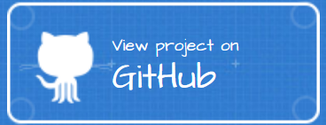

### RookGame

This project was created using C++ and Qt5. A screenshot of the game is shown below.

Check out the [wiki](https://github.com/nathanesau/RookGame/wiki/Rules) for rules on how to play the game. Execuctable of the game is avaiable for Windows on the releases page.

### Project Info

This project implemented the following:

* Save/ load games with sqlite
* Play against computer (computer logic implemented)
* Change game resolution (automatically re-scale app size)
* Graphical user interface (click on cards to play, etc.)

For more information about the game, please see the GitHub page.

This page was last updated on Sep 7, 2019.