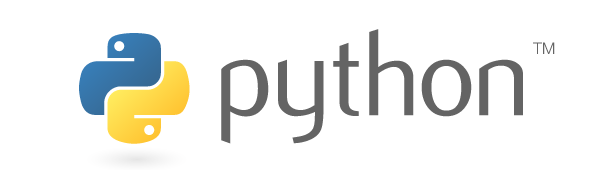

# Projects

A list of projects I have worked on are below:

## [C++ projects](/projects/cpp)

<td></td>

C++ is a general-purpose programming language created by Bjarne Stroustrup as an extension of the C programming language, or "C with Classes". Please go to my <a href="/projects/cpp">C++ projects</a> page for C++ projects I have worked on.

## [Python projects](/projects/python)

<td></td>

 
Python is an interpreted, high-level, general-purpose programming language. I have worked on a few PyQt projects. Please go to my <a href="/projects/python">Python projects</a> page for more info.

## [R projects](/projects/rpackages)

<td></td>

 
R is a free software environment for statistical computing and graphics. When I was in university, I wrote several R packages, mostly related to [actuarial science](https://en.wikipedia.org/wiki/Actuarial_science).
Please go to the my [R packages project page](/projects/rpackages) for more info.

## [Academic projects](/projects/academic-projects)

Some of my university projects are on my academic account [github.com/nathanesau-academic](https://github.com/nathanesau-academic).

## [Future projects](/projects/future-projects)

I am keeping track of some future project ideas I have on this website. For more info see <a href="/projects/future-projects">here</a>.

This page was last updated on Sept 7, 2019.
