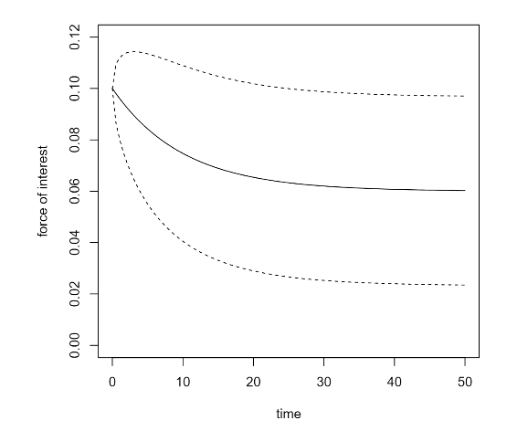

### stocins

<a href="https://github.com/nathanesau/stocins"></a>

This project was created to re-produce results derived by Parker in his 1992 thesis "An application of stochastic interest rate models in life assurance.
The first five chapters are implemented while the more complicated chapters on approximating the cumulative distribution of the portfolio has not been implemented.

### Brief User Guide

The package contains interest rate models code and code specific to calculating moments of insurance portfolios. First, install the package as shown below:

```R
devtools::install_github("nathanesau/stocins")
```

Then, load the package in ``R``. Here is some sample code to plot the expected value of an Ornstein-Uhlenbeck process.

```R
library(stocins)

oumodel = iratemodel(list(delta0=0.1, delta=0.06, alpha=0.1, sigma=0.01), "ou")
plot(function(t) delta.ev(t, oumodel), 0, 50, col='black', ylim=c(0,0.12),
     xlab="time", ylab="force of interest")
plot(function(t) delta.ev(t, oumodel) - 1.645 * sqrt(delta.var(t, oumodel)), 0, 50,
     add=TRUE, lty=2)
plot(function(t) delta.ev(t, oumodel) + 1.645 * sqrt(delta.var(t, oumodel)), 0, 50,
     add=TRUE, lty=2)
```

This should produce the plot shown below:



For more information on this package, please see the GitHub page.

This page was last updated on Sept 7, 2019.
